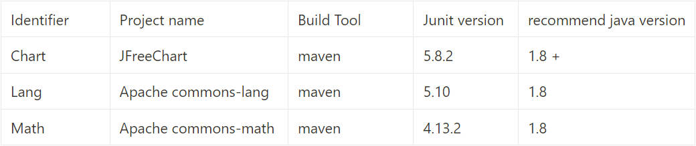
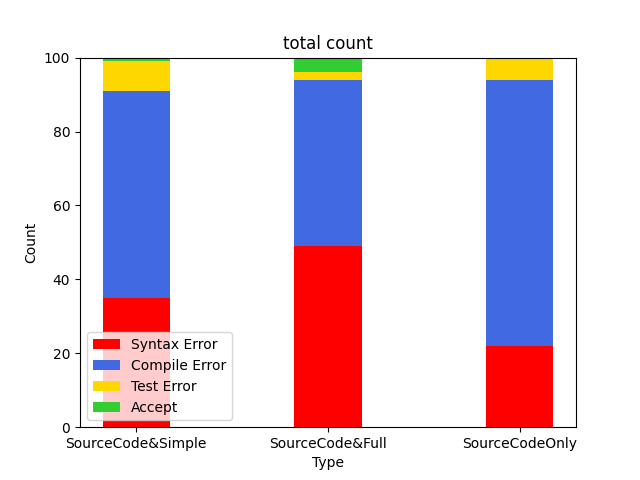
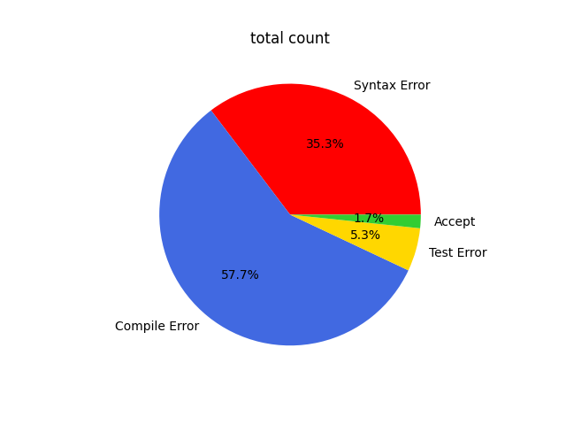
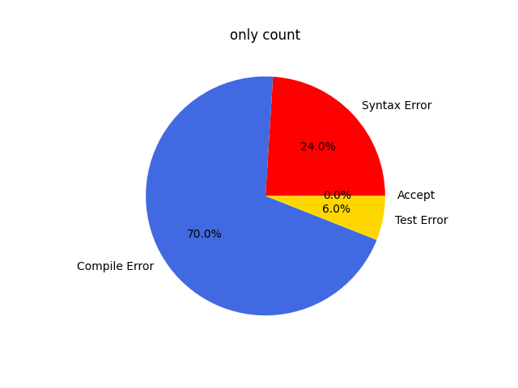
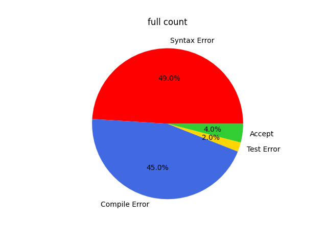
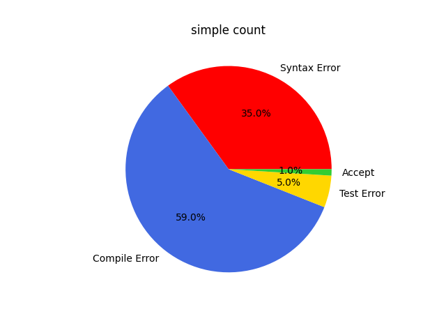

# TestCaseGeneration

### UT Benchmark指标
* 语法正确性（静态分析）--> javalang (寻找更好的分析工具，如joern等)
* 可编译性（动态分析） --> mvn compile
* 覆盖率 --> clover
* 缺陷检测 --> pitest(未做)
* 与人工对比

与前几个分支相比，这一版在codereval提供的github项目上进行了测试用例生成的实验。

### 进程

> $ main $ --> $ class\_eval $ --> $ human\_java $ --> $ codereval $ --> $ githubeval(now) $


### 目前阶段

请查看 [-- Click here --](https://sky-pie-b52.notion.site/unknown-7a44a631444d4555ace0789238ed125e?pvs=4)

### 使用说明

#### 1. 挑选待测函数
本项目在如图所示的三个项目中挑选了18个函数用于生成测试用例。
<!--  -->

<p align="center">项目信息</p>
>对于项目选择的要求是：Build Tool = maven；JUnit version > 4; java version > 1.8

内容保存在source_file.txt(可以按照格式要求进行增添)。

#### 2. 对项目进行解析
> 需要将 `extract_raw_file.py` 中 `relative_project_path` 改为保存java项目的路径。

```
python extract_raw_file.py
```

结果保存在 `./output/` 文件夹中。

#### 3. 根据解析结果生成测试用例(基于codellama)
> 运行前需确保运行 `ollama server` 或能够通过端口访问到该服务。
> 还需确保已下载codellama:13b模型。
```
python generate_test_codellama.py
```
结果保存在 `./test/` 文件夹中，目录结果如下：
```
project_name
├── class_method_1              # add number to avoid overwrite cause same method with different arguments
│   ├── SourceCodeOnly
│   │   ├── result.json         # handle easily
│   │   ├── result.txt          # read easily
│   ├── SourceCode&Full
│   └── SourceCode&Simple
├── class_method_2
├── class_method_3
└── ......
```

#### 4. 执行测试用例查看指标

```
python execute_test.py
```
结果保存在 `test_result.json` 中。

#### 5. 结果
```
python parse_result.py
```
结果保存在 `/img/` 文件夹中。


<p align="center">总和统计</p>


<p align="center">总和统计</p>


<p align="center">SourceCodeOnly</p>


<p align="center">SourceCode&Full</p>


<p align="center">SourceCode&Simple</p>